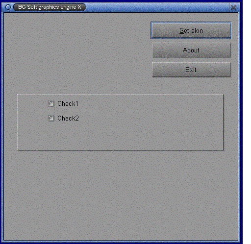



## Skin Engine

### Description

Application that shows you how to dynamically select skins. Lots of API calls and user controls.
 
### More Info
 

             |
---                |---
**Submitted On**   |2002-02-14 22:01:42
**By**             |[Branko Gojkovic](https://github.com/Planet-Source-Code/PSCIndex/blob/master/ByAuthor/branko-gojkovic.md)
**Level**          |Intermediate
**User Rating**    |5.0 (30 globes from 6 users)
**Compatibility**  |VB 5\.0, VB 6\.0
**Category**       |[Custom Controls/ Forms/  Menus](https://github.com/Planet-Source-Code/PSCIndex/blob/master/ByCategory/custom-controls-forms-menus__1-4.md)
**World**          |[Visual Basic](https://github.com/Planet-Source-Code/PSCIndex/blob/master/ByWorld/visual-basic.md)
**Archive File**   |[Skin\_Engin497031182002\.zip](https://github.com/Planet-Source-Code/branko-gojkovic-skin-engine__1-30944/archive/master.zip)

